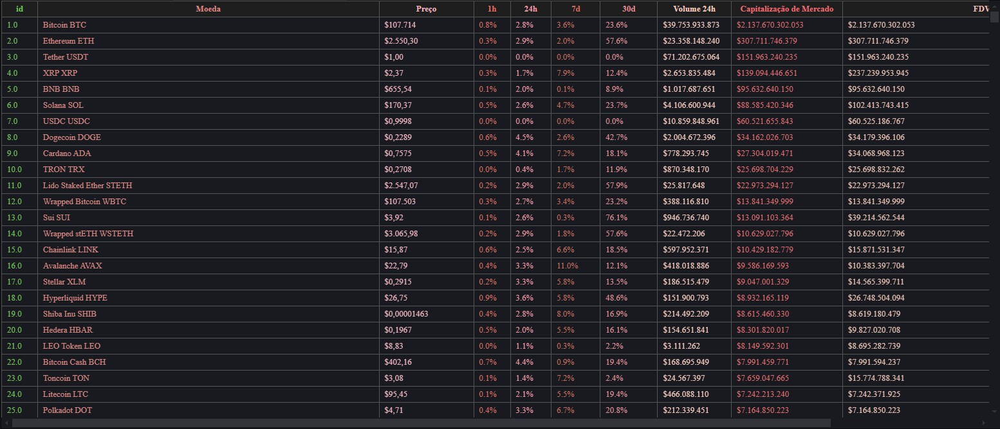

# CoinGecko Web Scraper (com Requests + Pandas)

Este projeto realiza o scraping de dados de criptomoedas do site [CoinGecko](https://www.coingecko.com/pt), utilizando as bibliotecas `requests` e `pandas`. Os dados são limpos e organizados em um DataFrame para análise posterior.

## 🧰 Tecnologias utilizadas
- Python
- Requests
- Pandas

## 🚀 Como rodar o projeto

### 1. Clone o repositório:
```bash
git clone https://github.com/seu-usuario/seu-repositorio.git
cd seu-repositorio
```

### 1. Crie um ambiente virtual (opcional):
```bash
python -m venv venv
source venv/bin/activate  # Linux/Mac
venv\Scripts\activate     # Windows
```
### 3. Instale as dependências:
```bash
pip install -r requirements.txt
```
### 4. Execute o script:
- Teste de coleta simples (apenas uma página):
```bash
python main.py
```
- Coleta completa com todas as páginas + limpeza dos dados:
```bash
python main2_coleta_limpeza.py
```
- Exporta o arquivo .csv
```bash
main3_DataFrame.py
```
## 🧪 Resultado

`DataFrame` com os dados coletados do site **CoinGecko**.



Os dados foram salvos em **CSV**.


## 📘 Próximos passos

Este repositório é focado em scraping com **`requests`**.

🔄 Para scraping com **Selenium**, consulte o projeto complementar: 

👉 [CoinGecko Scraper com Selenium](https://github.com/IasmimHorrana/CoinGecko-Scraper-com-Selenium)


